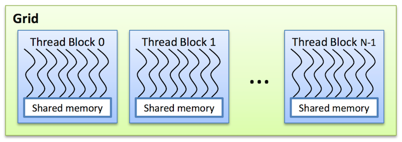
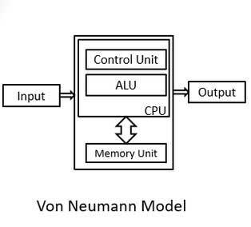

# If this repository helps you in anyway, show your love :heart: by putting a :star: on this project 

# Latency cores vs throughput cores

Latency cores stand for CPU and throughput cores stand for GPU cores. This is due to the difference between GPUs and CPUs. 

## See Fig. 1
In CPUs we have a few number of powerful arithmetic logic units (ALU) for reducing the computation latency, a large cache memory for reducing the data accessing latency and a control unit for reducing the data flowing latency. 

In GPUs we have a large number of power efficient and slow ALUs and small cache memory units. In every data cycle ALUs throughput the outputs. The cache memory units different from CPUs is used for consolidating the data distribution between the ALUs. In CPUs there are a few registry 

while on GPUs there are many registry in order to make the threading process possible.

CPUs are used for the serial computations in which low latency is needed while GPUs are used for parallel computation in which high throughput is required. 


# What is CUDA?

CUDA is a programming API for hetregenous parallel programming. 
The idea of CUDA programming is different parts of the data can be analysed independently from each other. The parallel computing using CUDA is based on device+host, in which host means the CPU and device means the GPU. On the host the application is run in serial and on the device we have the parallel computation which its function is called kernel. A kernel is notated by , in which  is the input arguments,  and  are the configuration parameters of the number of grids of threads. As the below figure shows each kernel will be executed by a number of thread blocks and each thread bock contains a number of threads. The execution of the kernel will be done on the host and device. 



CUDA is a high-level programming language similar to C/C++. However for fully undrestanding CUDA we have to go a bit into the Istruction set architecture (ISA). ISA a contract between software and hardware. ISA is a set of instruction that the hardware can execute. 

The below picture is a simple schema from how the Von-Neumann processor is working. A thread is an abstraction of the Von-Neumann processor.



Threads in the same block can cooprate via shared memory, atomic operations, and barrier synchronization. However threads in diffrerent blocks don't intract. 
The block index can be 1D, 2D, or 3D depends on the data type like sequences, images or volums. 

# Device memory allocation, and host to device data transfer
**cudaMalloc**: allocating memory for variables on the device.
```
float* d_var; 
size_t size = 100 * sizeof(float);
cudaMalloc((void**)d_var, size);
```
**cudaMemcpy**: copying a variable from host to device or the other way around.
```
cudaMemcpy((void*)h_a, d_a, size, cudaMemcpyHostToDevice);
cudaMemcpy(d_a, (void*)h_a, size, cudaMemcpyDeviceToHost);
```
**cudaFree**: free the allocated memory.
```
cudaFree(d_a);
```

# Resources

[1] Heterogeneous Parallel Programming by Wen-mei W. Hwu (University of Illinois)

