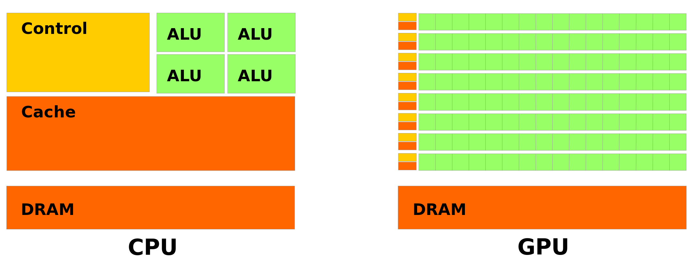

# Latency cores vs throughput cores

Latency cores stand for CPU and throughput cores stand for GPU cores. This is due to the difference between GPUs and CPUs. 

In CPUs we have a few number of powerful arithmetic logic units (ALU) for reducing the computation latency, a large cache memory for reducing the data accessing latency and a control unit for reducing the data flowing latency. 

In GPUs we have a large number of power efficient and slow ALUs and small cache memory units. In every data cycle ALUs throughput the outputs. The cache memory units different from CPUs is used for consolidating the data distribution between the ALUs. In CPUs there are a few registry 

while on GPUs there are many registry in order to make the threading process possible.

CPUs are used for the serial computations in which low latency is needed while GPUs are used for parallel computation in which high throughput is required. 

# What is CUDA?

CUDA is a programming API for hetregenous parallel programming. 
